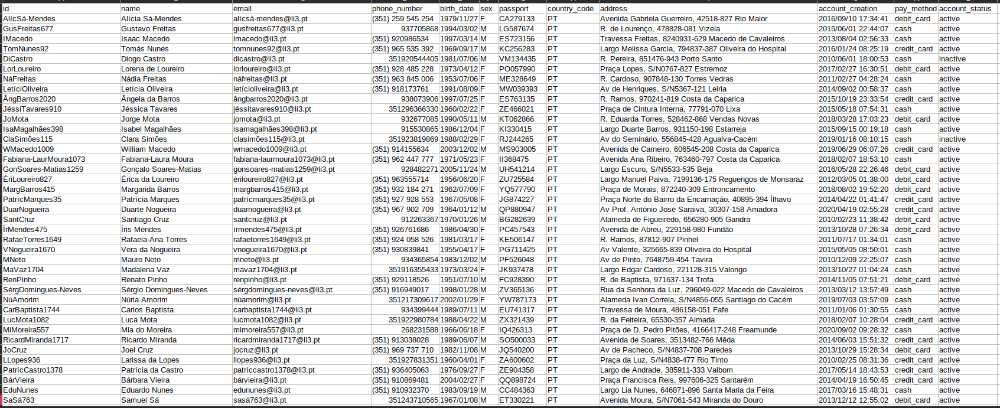

# Projeto HeavenBooking

**Nome do Projeto :** HeavenBooking  
**Data de Inicio :** 14/06/2025  
**Data de Conclusão:** ---  
**Autor :** André Campos

## Índice

- [1. Introdução](#1-introdução)
    - [1.1. Motivação e Objetivos](#11-motivação-e-objetivos)
    - [1.2. Tema](#12-tema)
- [2. Recolha do Dataset](#2-recolha-do-dataset)
    - [2.1. Alteração dos Datasets](#21-alteração-dos-datasets)
    - [2.2. Análise e Resultado das alterações efetuadas](#22-análise-e-resultado-das-alterações-efetuadas)
- [3. Requisitos](#3-requisitos)
    - [3.1. Requisitos Funcionais - Backend](#31-requisitos-funcionais---backend)
    - [3.2. Validação de dados](#32-validação-de-dados)
    - [3.3. Requisitos Funcionais - Frontend](#33-requisitos-funcionais---frontend)
    - [3.4. Requisitos Não Funcionais](#34-requisitos-não-funcionais)
- [4. Preparação e Tratamento dos Dados](#4-preparação-e-tratamento-dos-dados)
- [5. Arquitetura](#5-arquitetura)
- [6. Esboço de Interfaces](#6-esboço-de-interfaces)
- [7. Persistência de Dados](#7-persistência-de-dados)
- [8. Lógica de Negócio](#8-lógica-de-negócio)
- [9. Interface de Utilizador](#9-interface-de-utilizador)
- [10. Outras Features](#10-outras-features)
- [11. Testes e Gestão do Sistema](#11-testes-e-gestão-do-sistema)
- [12. Conclusão](#12-conclusão)

## 1. Introdução

### 1.1 Motivação e Objetivos

Este projeto é um trabalho extra-curricular com os **objetivos** de:
- Criar uma aplicação Web
- Criar um projeto que siga a arquitetura Web de 3 camadas
- Guardar os ficheiros em disco, de forma persistente, usando uma base de dados relacional com objetivo de aprimorar o conhecimento de Base de Dados
- Criar uma Lógica de Negócio usando uma nova linguagem de programação orientada a objetos
- Explorar formas eficientes de manipular e usar milhares de dados
- Desenvolver uma Interface de Utilizador utilizando HTML, CSS e JavaScript com o objetivo de aprimorar o conhecimento em UI
- Criar dois serviços principais : Frontend e Backend
- Utilizar sockets e HTTP  
- **Criar um sistema complexo e completo!**

### 1.2. Tema

Como o projeto é um Sistema de Gestão de bastantes dados, decidi reutilizar e aprimorar um projeto da Unidade Curricular **Laboratórios Informáticos III**  
_Enunciado entra-se [aqui](Report/Enunciado-LI3.pdf)_

Neste projeto, temos as seguintes entidades:
1. **Utilizadores :** os utilizadores são registados no sistema, podendo estar ativos ou não, que contêm reservas ou voos do utilizador
2. **Reservas :** as reservas pertencem a um único utilizador e pertencem a um único Hotel. As reservas contêm informações sobre o preço das mesmas
3. **Hoteis :** os hoteis são edificios que contêm informações sobre as suas localizações, características e as reservas efetuadas neles
4. **Voos :** cada voo contém uma lista de utilizadores, que são os passageiros, as características do avião que efetua o voo e os aeroportos de partida e destino do voo
5. **Aeroportos :** os aeroportos são localidades onde os voos partem ou chegam

Nesse projeto, foram pedidos que houvessem três funcionalidades principais:
1. **Batch :** os dados e um conjunto de queries eram lidas e o programa apenas tinha que resolver as queries indicadas
2. **Interativo :** os dados eram lidos e o utilizador poderia ativamente executar queries, decidindo quando poderia parar o sistema
3. **Modo de testes :** o resultados das queries eram comparados com um conjunto de ficheiros corretos para indicar se o sistema executa as queries corretamente

Como este projeto tem o objetivo de ser uma aplicação web, ela terá:
- **Modo de testes** para verificar se o sistema está correto
- Faz muito mais sentido fazer uma abordagem do modo **interativo**, então o modo batch será ignorado

## 2. Recolha do Dataset

A escolha de datasets é o principal foco neste projeto, pois todo o projeto anda à volta deles.
Como dito acima, decidi utilizar os datasets atribuídos no projeto currícular (Laboratórios Informáticos III), pois:
- Tem vários dados diversos
- Existem muitos metadados

Os datasets em questão têm este formato:

1. **Dataset de Utilizadores**  

2. **Dataset de Reservas**  

3. **Dataset de Voos**  

4. **Dataset de Passageiros**  

### 2.1. Alteração dos Datasets

Decidi reorganizar os datasets e acrescentar mais informação para que o sistema tivesse mais informação para apresentar

1. **Utilizadores**
    - Juntei os utilizadores dos dois datasets
    - Como já haviam bastante atributos, não adicionei nenhum
    - Alterei o país, emails, moradas e número de telemóvel dos utilizadores de forma a não haver 100% utilizadores portugueses

2. **Reservas**
    - Juntei as reservas dos dois datasets
    - Atribuí um novo campo chamado "Refund", que indica se uma reserva foi reembolsada
    - Retirei os atributos dos hoteis para os colocar num outro dataset dedicado a hoteis

3. **Hoteis**
    - Dataset novo criado com base nos dados encontrados nas reservas
    - Para além dos campos extraídos, foram adicionados novos campos, tais como:
        - País
        - Código do País
        - Link do website do hotel
        - Número de telemóvel
        - Código Pin
        - Se está ativo
    - Foram adicionados novos hoteis, que são marcados como inativos pois não serão utilizados para realizar reservas
    - Os dados foram pesquisados na internet através do site [booking.com](https://booking.com), através de um dataset disponibilizado no [kaggle.com](https://www.kaggle.com/datasets/raj713335/tbo-hotels-dataset) e através de informações ao pesquisar pelo nome dos hoteis

4. **Voos**
    - Juntei os voos dos dois datasets
    - Atribuí um novo campo chamado "Cancelled", que indica se um voo foi cancelado
    - Já havia bastante metadata e o dataset apenas dá a identificação de aeroportos, não as suas características

5. **Aeroportos**
    - Dataset novo criado com base nos dados encontrados nos voos
    - A única informação dada era a identificação do aeroporto, então decidi adicionar a seguinte metainformação:
        - Nome
        - Código IATA, se disponível
        - País onde se localiza
        - Código do País
        - Ano de inauguração
        - Se está ativo ou não
    - Foram adicionados novos aeroportos, que poderão estar ativos ou não
    - Os dados foram coletados através do site [openflights.org](https://www.openflights.org/data)

6. **Passageiros**
    - Juntei os passageiros dos dois datasets
    - Atribuí um novo campo chamado "User Arrived", que indica se um utilizador embarcou num voo
    - Este dataset é uma tabela de união, então não é preciso adicionar mais metadados ou efetuar alterações

### 2.2. Análise e Resultado das alterações efetuadas

As metainformações de cada dataset são:

**1. Utilizadores**

| Nome do Metadado | Significado do Metadado |
|:-----------------|-----------|
| `ID` | Identificador do Utilizador |
| `Name` | Nome |
| `Email` | Email |
| `Phone Number` | Número de Telemóvel |
| `Birth Date` | Data de Nascimento |
| `Sex` | Género |
| `Passport` | Passaporte |
| `Country Code` | Código do País de origem |
| `Address` | Morada |
| `Account Creation` | Data de criação de conta (data e hora) |
| `Pay Method` | Método de Pagamento |
| `Account Status` | Estado atual da conta |

**2. Reservas**

| Nome do Metadado | Significado do Metadado |
|:-----------------|-----------|
| `ID` | Identificador da Reserva |
| `User ID` | Identificador do Utilizador que a reservou |
| `Hotel ID` | Identificador do Hotel a quem a reserva pertence |
| `Begin Date` | Data de Inicio |
| `End Date` | Data de Fim |
| `Price Per Night` | Preço por Noite |
| `Includes Breakfast` | Indica se a reserva inclui pequeno-almoço |
| `Refunded` | Indica se a reserva foi reembolsada |
| `Room Details` | Detalhes sobre o quarto |
| `Rating` | Classificação (opcional) atribuída pelo utilizador |
| `Comment` | Comentário (opcional) sobre a reserva |

**3. Hoteis**

| Nome do Metadado | Significado do Metadado |
|:-----------------|-----------|
| `ID` | Identificador do Hotel |
| `Name` | Nome |
| `Stars` | Estrelas do hotel (1 a 5) |
| `City Tax` | Percentagem do imposto da cidade sobre o valor total (valores inteiros) |
| `Address` | Morada do hotel |
| `Country` | País onde o hotel se localiza |
| `Country Code` | Código do país |
| `Website` | URL do website do hotel |
| `Phone Number` | Número de telemóvel do hotel |
| `Pin Code` | Código PIN do hotel |
| `Active` | Indica se o hotel está ativo |

**4. Voos**

| Nome do Metadado | Significado do Metadado |
|:-----------------|-----------|
| `ID` | Identificador do Voo |
| `Airline` | Companhia aérea |
| `Plane Model` | Modelo do avião |
| `Total Seats` | Número de lugares totais disponíveis |
| `Cancelled` | Indica se o voo foi cancelado |
| `Origin` | Identificador do aeroporto de origem |
| `Destination` | Identificador do aeroporto de chegada |
| `Schedule Departure Date` | Data e hora estimada de partida |
| `Schedule Arrival Date` | Data e hora estimada de chegada |
| `Real Departure Date` | Data e hora real de partida |
| `Real Arrival Date` | Data e hora real de chegada |
| `Pilot` | Nome do piloto |
| `Copilot` | Nome do copiloto |
| `Notes` | Observações sobre o voo |

**5. Aeroportos**

| Nome do Metadado | Significado do Metadado |
|:-----------------|-----------|
| `ID` | Identificador do Aeroporto |
| `Name` | Nome |
| `IATA` | Código IATA, se disponível |
| `Country` | País onde o aeroporto localiza-se |
| `Country Code` | Código de país |
| `Start Date` | Ano de inauguração do aeroporto |
| `Active` | Indica se o aeroporto está ativo |

**6. Passageiros**

| Nome do Metadado | Significado do Metadado |
|:-----------------|-----------|
| `Flight ID` | Identificador do Voo |
| `User ID` | Identificador do Utilizador |
| `User Arrived` | Indica se o utilizador embarcou no voo |

**Considerações :**
- As datas devem seguir o formato `aaaa/mm/dd` ou `aaaa/mm/dd hh:mm:ss` em datas com tempo
- Os números decimais deverão ser arrendondadas a três casas décimais
- O custo total de uma reserva calcula-se com base na seguinte formúla : `preço_por_noite * número de noites + ( (preço_por_noite * número_de_noites) / 100 ) * imposto_da_cidade`

**Resultado dos novos Datasets :**

|  | Utilizadores | Reservas | Hoteis | Voos | Aeroportos | Passageiros |
|:-----------------|:-----------:|:-----------:|:-----------:|:-----------:|:-----------:|:-----------:|
| **Dados do dataset grande** | 990133 | 5936637 | 90 | 179945 | 27 | 14691055 |
| **Dados do dataset pequenos novos** | 5551 | 564 | 0 | 103 | 0 | 8045 |
| **Dados do dataset pequenos alterados** | 3913 | 37794 | 0 | 847 | 0 | 65282 |
| **Dados novos adicionados** | 0 | 0 | 9 | 0 | 8 | 0 |
| **Dados do dataset final** | 995684 | 5937201 | 99 | 180048 | 35 | 14699100 |

## 3. Requisitos

Nesta secção são apresentados os requisitos deste sistema, tais como:
- Requisitos Funcionais do Backend
- Validação de dados
- Requisitos Funcionais do Frontend
- Requisitos Não Funcionais

### 3.1. Requisitos Funcionais - Backend

Os requisitos funcionais do backend estão apresentados em formato de tabela, seguindo a seguinte estrutura:
- **Título :** título do requisito
- **URL :** url que será usado na API
- **Funcionalidade :** o que o requisito pede
- **Entrada :** quais são os parâmetros que o requisito precisa
- **Saída :** o que o requisito fornece
- **Pré-Condição :** o que é preciso acontecer para que o requisito seja executado com sucesso
- **Pós-Condição :** o que acontece após o requisito ser executado
- **Exceção :** o que pode acontecer para que o requisito não possa ser executado

|  | **Requisito 1** |
|------------|---|
| **Título** | Resumo de um Utilizador |
| **URL**| `GET /users/:id` |
| **Funcionalidade** | Dado um Utilizador, devemos dar algumas métricas sobre ele |
| **Entrada** | ID do Utilizador |
| **Saída** | Nome, sexo, idade, código do país, passaporte, número de voos, número de reservas, gasto total, número de voos perdidos, número de reservas reembolsadas e se está ativo |
| **Pré-Condição** | Utilizador existe |
| **Pós-Condição** | Informações do Utilizador |
| **Exceções** | Utilizador não existe |

_Nota : O número total gasto de um utilizador é calculado a partir da soma dos seus gastos em reservas não reembolsadas_

|  | **Requisito 2** |
|------------|---|
| **Título** | Lista de utilizadores |
| **URL**| `GET /users` |
| **Funcionalidade** | Dá a lista de utilizadores, indicando se cada utilizador está ativo ou não, o seu ID, o seu nome e o código de país |
| **Entrada** | - |
| **Saída** | Lista de utilizadores com as informações indicadas acima |
| **Pré-Condição** | - |
| **Pós-Condição** | Lista de utilizadores com as informações indicadas acima |
| **Exceções** | - |

_Nota : A lista deve estar ordenada de forma decrescente com base na data de criação, isto é, as contas mais recentes primeiro_

|  | **Requisito 3** |
|------------|---|
| **Título** | Criar um Utilizador |
| **URL**| `POST /users/` |
| **Funcionalidade** | Validar os dados de um Utilizador e inseri-lo no sistema |
| **Entrada** | Dados do Utilizador e o seu ID |
| **Saída** | ID do utilizador, estado a indicar se o utilizador foi inserido e uma mensagem de erro caso não seja adicionado  |
| **Pré-Condição** | Informação do Utilizador |
| **Pós-Condição** | Utilizador inserido no Sistema |
| **Exceções** | Validação do Utilizador falha |

|  | **Requisito 4** |
|------------|---|
| **Título** | Editar um Utilizador |
| **URL**| `PUT /users/:id` |
| **Funcionalidade** | Validar os dados novos do Utilizador e atualiza-lo |
| **Entrada** | Dados novos do Utilizador e o seu ID |
| **Saída** | ID do utilizador, estado a indicar se o utilizador foi editado e uma mensagem de erro caso não seja editado  |
| **Pré-Condição** | Informação do Utilizador e Utilizador existe |
| **Pós-Condição** | Utilizador atualizado no Sistema |
| **Exceções** | Validação do Utilizador falha ou Utilizador não existe |

|  | **Requisito 5** |
|------------|---|
| **Título** | Apagar um Utilizador |
| **URL**| `DELETE /users/:id` |
| **Funcionalidade** | Eliminar todas as ações do utilizador, como as suas reservas e voos, e o próprio |
| **Entrada** | ID do Utilizador |
| **Saída** | ID do utilizador, estado a indicar se o utilizador foi apagado e uma mensagem de erro caso não seja apagado  |
| **Pré-Condição** | Utilizador existe |
| **Pós-Condição** | Utilizador apagado no Sistema, juntamente com as suas ações |
| **Exceções** | Utilizador não existe |

|  | **Requisito 6** |
|------------|---|
| **Título** | Resumo de uma Reserva |
| **URL**| `GET /reservations/:id` |
| **Funcionalidade** | Dado uma Reserva, devemos dar algumas métricas sobre ela |
| **Entrada** | ID da Reserva |
| **Saída** | Nome, identificador e estrelas do hotel, datas de inicio e fim, se inclui pequeno-almoço, a quantidade de noites, preço da reserva e se foi reembolsada |
| **Pré-Condição** | Reserva existe |
| **Pós-Condição** | Se a reserva foi reembolsada, não mostra o seu preço, se inclui pequeno-almoço e a quantidade de noites. Caso contrário, dá todas as informações ditas |
| **Exceções** | Reserva não existe |

_Nota : O número de noites de uma reserva é calculado a partir da diferença entre a datas de início e fim_

|  | **Requisito 7** |
|------------|---|
| **Título** | Lista de reservas |
| **URL**| `GET /reservations` |
| **Funcionalidade** | Dá a lista de reservas, indicando se cada reserva foi reembolsada ou não, o seu ID, o hotel onde pertence e o preço total |
| **Entrada** | - |
| **Saída** | Lista de reservas com as informações indicadas acima |
| **Pré-Condição** | - |
| **Pós-Condição** | Lista de reservas com as informações indicadas acima |
| **Exceções** | - |

_Nota : A lista deve estar ordenada de forma decrescente com base na data de criação, isto é, as contas mais recentes primeiro_

|  | **Requisito 8** |
|------------|---|
| **Título** | Criar uma Reserva |
| **URL**| `POST /reservations/` |
| **Funcionalidade** | Validar os dados de uma Reserva e inseri-la no sistema |
| **Entrada** | Dados da Reserva |
| **Saída** | ID da reserva, estado a indicar se a reserva foi inserida e uma mensagem de erro caso não seja adicionada  |
| **Pré-Condição** | Informação da Reserva |
| **Pós-Condição** | Reserva inserida no Sistema |
| **Exceções** | Validação da Reserva falha |

|  | **Requisito 9** |
|------------|---|
| **Título** | Editar uma Reserva |
| **URL**| `PUT /reservations/:id` |
| **Funcionalidade** | Validar os dados novos da Reserva e atualiza-la |
| **Entrada** | Dados novos da Reserva e o seu ID |
| **Saída** | ID da reserva, estado a indicar se a reserva foi editado e uma mensagem de erro caso não seja editada  |
| **Pré-Condição** | Informação da Reserva e Reserva existe |
| **Pós-Condição** | Reserva atualizada no Sistema |
| **Exceções** | Validação da Reserva falha ou Reserva não existe |

|  | **Requisito 10** |
|------------|---|
| **Título** | Apagar uma Reserva |
| **URL**| `DELETE /reservations/:id` |
| **Funcionalidade** | Eliminar a reserva e o seu impacto no utilizador e hotel |
| **Entrada** | ID da Reserva |
| **Saída** | ID da reserva, estado a indicar se a reserva foi apagada e uma mensagem de erro caso não seja apagada  |
| **Pré-Condição** | Reserva existe |
| **Pós-Condição** | Reserva apagada no Sistema, juntamente com as suas ações |
| **Exceções** | Reserva não existe |

|  | **Requisito 11** |
|------------|---|
| **Título** | Resumo de um Voo |
| **URL**| `GET /flights/:id` |
| **Funcionalidade** | Dado um Voo, devemos dar algumas métricas sobre ele |
| **Entrada** | ID do Voo |
| **Saída** | Companhia, modelo do avião, aeroportos de origem e destino, data e hora estimadas de partida e chegada, tempo de atraso, número de passageiros esperados, número de passageiros que não embarcaram e se foi cancelado |
| **Pré-Condição** | Voo existe |
| **Pós-Condição** | Se o voo foi cancelado, não mostra a data de chegada nem o atraso. Caso contrário, dá todas as informações ditas |
| **Exceções** | Voo não existe |

_Nota : O atraso de um avião é calculado a partir da diferença entre a data estimada de partida e a data real de partida_

|  | **Requisito 12** |
|------------|---|
| **Título** | Lista de voos |
| **URL**| `GET /flights` |
| **Funcionalidade** | Dá a lista de voos, indicando o seu ID, se foi cancelado e quais os aeroportos de chegada e partida |
| **Entrada** | - |
| **Saída** | Lista de voos com as informações indicadas acima |
| **Pré-Condição** | - |
| **Pós-Condição** | Lista de voos com as informações indicadas acima |
| **Exceções** | - |

_Nota : A lista deve estar ordenada de forma decrescente com base na data de criação, isto é, as contas mais recentes primeiro_

|  | **Requisito 13** |
|------------|---|
| **Título** | Criar um Voo |
| **URL**| `POST /flights/` |
| **Funcionalidade** | Validar os dados de um Voo e inseri-lo no sistema |
| **Entrada** | Dados do Voo |
| **Saída** | ID do voo, estado a indicar se o voo foi inserido e uma mensagem de erro caso não seja adicionado  |
| **Pré-Condição** | Informação do Voo |
| **Pós-Condição** | Voo inserido no Sistema |
| **Exceções** | Validação do Voo falha |

|  | **Requisito 14** |
|------------|---|
| **Título** | Editar um Voo |
| **URL**| `PUT /flights/:id` |
| **Funcionalidade** | Validar os dados novos do Voo e atualiza-lo |
| **Entrada** | Dados novos do Voo e o seu ID |
| **Saída** | ID do voo, estado a indicar se o voo foi editado e uma mensagem de erro caso não seja editado  |
| **Pré-Condição** | Informação do Voo e Voo existe |
| **Pós-Condição** | Voo atualizado no Sistema |
| **Exceções** | Validação do Voo falha ou Voo não existe |

|  | **Requisito 15** |
|------------|---|
| **Título** | Apagar um Voo |
| **URL**| `DELETE /flights/:id` |
| **Funcionalidade** | Eliminar o voo e as suas influências no utilizador e aeroporto |
| **Entrada** | ID do Voo |
| **Saída** | ID do voo, estado a indicar se o voo foi apagado e uma mensagem de erro caso não seja apagado  |
| **Pré-Condição** | Voo existe |
| **Pós-Condição** | Voo apagado no Sistema, juntamente com as suas influências |
| **Exceções** | Voo não existe |

|  | **Requisito 16** |
|------------|---|
| **Título** | Resumo de um Hotel |
| **URL**| `GET /hotels/:id` |
| **Funcionalidade** | Dado um Hotel, devemos dar algumas métricas sobre ele |
| **Entrada** | ID do Hotel |
| **Saída** | Nome, as estrelas, o endereço, o país onde se localiza juntamente com o código do país, o website, se está ativo e o número de reservas |
| **Pré-Condição** | Hotel existe |
| **Pós-Condição** | Informações do Hotel |
| **Exceções** | Hotel não existe |

|  | **Requisito 17** |
|------------|---|
| **Título** | Lista de hoteis |
| **URL**| `GET /hotels` |
| **Funcionalidade** | Dá a lista de hoteis, indicando se cada hotel está ativo ou não, o seu nome, o seu endereço, as suas estrelas e a quantidade de reservas |
| **Entrada** | - |
| **Saída** | Lista de hoteis com as informações indicadas acima |
| **Pré-Condição** | - |
| **Pós-Condição** | Lista de hoteis com as informações indicadas acima |
| **Exceções** | - |

_Nota : A lista deve estar ordenada de forma decrescente com base na data de criação, isto é, as contas mais recentes primeiro_

|  | **Requisito 18** |
|------------|---|
| **Título** | Criar um Hotel |
| **URL**| `POST /hotels/` |
| **Funcionalidade** | Validar os dados de um Utilizador e inseri-lo no sistema |
| **Entrada** | Dados do Utilizador e o seu ID |
| **Saída** | ID do utilizador, estado a indicar se o utilizador foi inserido e uma mensagem de erro caso não seja adicionada  |
| **Pré-Condição** | Informação do Utilizador |
| **Pós-Condição** | Utilizador inserido no Sistema |
| **Exceções** | Validação do Utilizador falha |

|  | **Requisito 19** |
|------------|---|
| **Título** | Editar um Utilizador |
| **URL**| `PUT /hotels/:id` |
| **Funcionalidade** | Validar os dados novos do Utilizador e atualiza-lo |
| **Entrada** | Dados novos do Utilizador e o seu ID |
| **Saída** | ID do utilizador, estado a indicar se o utilizador foi editado e uma mensagem de erro caso não seja editado  |
| **Pré-Condição** | Informação do Utilizador e Utilizador existe |
| **Pós-Condição** | Utilizador atualizado no Sistema |
| **Exceções** | Validação do Utilizador falha ou Utilizador não existe |

|  | **Requisito 20** |
|------------|---|
| **Título** | Apagar um Utilizador |
| **URL**| `DELETE /hotels/:id` |
| **Funcionalidade** | Eliminar todas as ações do utilizador, como as suas reservas e voos |
| **Entrada** | ID do Utilizador |
| **Saída** | ID do utilizador, estado a indicar se o utilizador foi apagado e uma mensagem de erro caso não seja apagado  |
| **Pré-Condição** | Utilizador existe |
| **Pós-Condição** | Utilizador apagado no Sistema, juntamente com as suas ações |
| **Exceções** | Utilizador não existe |

|  | **Requisito 21** |
|------------|---|
| **Título** | Resumo de um Aeroporto |
| **URL**| `GET /airports/:id` |
| **Funcionalidade** | Dado um Aeroporto, devemos dar algumas métricas sobre ele |
| **Entrada** | ID do Aeroporto |
| **Saída** | Nome, código do país, páis, ano de inauguração, se está ativo e quantos voos partiram e chegaram no aeroporto |
| **Pré-Condição** | Aeroporto existe |
| **Pós-Condição** | Informações do Aeroporto |
| **Exceções** | Aeroporto não existe |

|  | **Requisito 22** |
|------------|---|
| **Título** | Lista de aeroportos |
| **URL**| `GET /airports` |
| **Funcionalidade** | Dá a lista de aeroportos, indicando se cada aeroporto está ativo, o seu ID, o seu código de país e a sua quantidade de voos, os que partiram e chegaram |
| **Entrada** | - |
| **Saída** | Lista de aeroportos com as informações indicadas acima |
| **Pré-Condição** | - |
| **Pós-Condição** | Lista de aeroportos com as informações indicadas acima |
| **Exceções** | - |

_Nota : A lista deve estar ordenada de forma decrescente com base na data de criação, isto é, as contas mais recentes primeiro_

|  | **Requisito 23** |
|------------|---|
| **Título** | Criar um Aeroporto |
| **URL**| `POST /airports/` |
| **Funcionalidade** | Validar os dados de um Aeroporto e inseri-lo no sistema |
| **Entrada** | Dados do Aeroporto e o seu ID |
| **Saída** | ID do aeroporto, estado a indicar se o aeroporto foi inserido e uma mensagem de erro caso não seja adicionado  |
| **Pré-Condição** | Informação do Aeroporto |
| **Pós-Condição** | Aeroporto inserido no Sistema |
| **Exceções** | Validação do Aeroporto falha |

|  | **Requisito 24** |
|------------|---|
| **Título** | Editar um Aeroporto |
| **URL**| `PUT /airports/:id` |
| **Funcionalidade** | Validar os dados novos do aeroporto e atualiza-lo |
| **Entrada** | Dados novos do Aeroporto e o seu ID |
| **Saída** | ID do aeroporto, estado a indicar se o aeroporto foi editado e uma mensagem de erro caso não seja editado  |
| **Pré-Condição** | Informação do Aeroporto e Aeroporto existe |
| **Pós-Condição** | Aeroporto atualizado no Sistema |
| **Exceções** | Validação do Aeroporto falha ou Aeroporto não existe |

|  | **Requisito 25** |
|------------|---|
| **Título** | Apagar um Aeroporto |
| **URL**| `DELETE /airports/:id` |
| **Funcionalidade** | Eliminar aeroporto, assim como os seus voos |
| **Entrada** | ID do Aeroporto |
| **Saída** | ID do aeroporto, estado a indicar se o aeroporto foi apagado e uma mensagem de erro caso não seja apagado  |
| **Pré-Condição** | Aeroporto existe |
| **Pós-Condição** | Aeroporto apagado no Sistema, juntamente com os seus voos |
| **Exceções** | Aeroporto não existe |

|  | **Requisito 26** |
|------------|---|
| **Título** | Lista de Reservas de um Utilizador |
| **URL**| `GET /reservations-of-user/:id` |
| **Funcionalidade** | Dado um Utilizador, devemos apresentar as suas reservas, da mais recente para a mais antiga |
| **Entrada** | ID do Utilizador |
| **Saída** | IDs das reservas, as suas datas de início e se foi reembolsado |
| **Pré-Condição** | Utilizador existe e está ativo |
| **Pós-Condição** | Reservas do Utilizador |
| **Exceções** | Utilizador não existe ou não está ativo |

_Nota : Para comparação de reservas, utiliza-se a data de inicio. Em caso de empate, é utilizado o seu ID, de forma crescente_

|  | **Requisito 27** |
|------------|---|
| **Título** | Lista de Voos de um Utilizador |
| **URL**| `GET /flights-of-user/:id` |
| **Funcionalidade** | Dado um Utilizador, devemos apresentar os seus voos , da mais recente para a mais antiga |
| **Entrada** | ID do Utilizador |
| **Saída** | IDs dos voos, as suas datas de partida e se o voo foi cancelado, se o utilizador embarcou ou não |
| **Pré-Condição** | Utilizador existe e está ativo |
| **Pós-Condição** | Voos do Utilizador |
| **Exceções** | Utilizador não existe ou não está ativo |

_Nota : Para comparação de voos, utiliza-se a data de partida esperada. Em caso de empate, é utilizado o seu ID, de forma crescente_

|  | **Requisito 28** |
|------------|---|
| **Título** | Classificação média de um Hotel |
| **URL**| `GET /rating-hotel/:id` |
| **Funcionalidade** | Dado um Hotel, devemos indicar qual a sua classificação média de um hotel com base na classificação das suas reservas |
| **Entrada** | ID do Hotel |
| **Saída** | Classificação média do hotel |
| **Pré-Condição** | Hotel existe |
| **Pós-Condição** | Classificação média do hotel |
| **Exceções** | Hotel não existe |

_Nota : as classificações consideradas das reservas devem existir. Se uma reserva não ter classificação, não deverá ser utilizada para o calculo da classificação média_

|  | **Requisito 29** |
|------------|---|
| **Título** | Classificações de um Hotel |
| **URL**| `GET /all-ratings-hotel/:id` |
| **Funcionalidade** | Dado um Hotel, devemos indicar quais as classificações de um Hotel |
| **Entrada** | ID do Hotel |
| **Saída** | Quantidade de classificações de 1, 2, 3, 4 e 5 estrelas e quantas reservas não foram classificadas |
| **Pré-Condição** | Hotel existe |
| **Pós-Condição** | Classificações do hotel |
| **Exceções** | Hotel não existe |

|  | **Requisito 30** |
|------------|---|
| **Título** | Reservas de um Hotel |
| **URL**| `GET /reservations-of-hotel/:id` |
| **Funcionalidade** | Dado um Hotel, devemos indicar quais as suas reservas |
| **Entrada** | ID do Hotel |
| **Saída** | Reservas do hotel, onde em cada reserva tem o seu ID, datas de início e fim, o ID do utilizador que a efetuou, o preço total e se foi reembolsada. Caso a reserva seja reembolsada, as informações do utilizador e do preço total não aparecem |
| **Pré-Condição** | Hotel existe |
| **Pós-Condição** | Reservas do hotel |
| **Exceções** | Hotel não existe |

|  | **Requisito 31** |
|------------|---|
| **Título** | Voos de um Aeroporto |
| **URL**| `GET /flights-of-airport/:id/:date_begin/:date_end` |
| **Funcionalidade** | Dado um Aeroporto e duas datas, devemos indicar os voos que partem dele |
| **Entrada** | ID do Aeroporto, data de inicio e data de fim |
| **Saída** | Os voos de um aeroporto deverão ter o ID, a data esperada de partida, o ID do aeroporto destino, a companhia, o modelo do avião e informação a indicar se o voo saiu com ou sem atraso ou se foi cancelado |
| **Pré-Condição** | Aeroporto existe e data de inicio acontece antes da data de fim |
| **Pós-Condição** | Voos do Aeroporto |
| **Exceções** | Aeroporto não existe ou datas inválidas |

|  | **Requisito 32** |
|------------|---|
| **Título** | Top aeroportos com mais passageiros |
| **URL**| `GET /top-passengers-airport/:year` |
| **Funcionalidade** | Dado um ano e um número, devemos indicar quais são os top aeroportos com maior número de passageiros (que partiram e chegaram) num certo ano |
| **Entrada** | Ano e um Número |
| **Saída** | Lista de aeroportos ordenados, onde cada elemento tem o ID do aeroporto e o número de passageiros |
| **Pré-Condição** | Ano válido |
| **Pós-Condição** | Lista de aeroportos |
| **Exceções** | Ano inválido |

_Nota : Na comparação, caso 2 aeroportos tenham o mesmo número, deverá ser usado o ID, de forma crescente, como forma de desempate_

|  | **Requisito 33** |
|------------|---|
| **Título** | Top aeroportos com a maior mediana de atrasos |
| **URL**| `GET /top-delay-airport` |
| **Funcionalidade** | Devemos indicar o top aeroportos com maior mediana de atrasos |
| **Entrada** | - |
| **Saída** | Lista de aeroportos ordenados, onde cada elemento tem o ID do aeroporto e a mediana de atrasos |
| **Pré-Condição** | - |
| **Pós-Condição** | Lista de aeroportos |
| **Exceções** | - |

_Nota : Na comparação, caso 2 aeroportos tenham a mesma mediana, deverá ser usado o ID, de forma crescente, como forma de desempate_  
_Nota 2 : O atraso deverá ser apresentado em segundos_

|  | **Requisito 34** |
|------------|---|
| **Título** | Top hoteis com mais reservas |
| **URL**| `GET /top-reservations-hotels` |
| **Funcionalidade** | Devemos indicar o top hoteis com mais reservas |
| **Entrada** | - |
| **Saída** | Lista de hoteis ordenados, onde cada elemento tem o ID do hotel e a quantidade de reservas |
| **Pré-Condição** | - |
| **Pós-Condição** | Lista de hoteis |
| **Exceções** | - |

_Nota : Na comparação, caso 2 hoteis tenham a mesma quantidade de reservas, deverá ser usado o ID, de forma crescente, como forma de desempate_  

|  | **Requisito 35** |
|------------|---|
| **Título** | Receita total de um hotel |
| **URL**| `GET /revenue-hotel/:id/:date_begin/:date_end` |
| **Funcionalidade** | Dado um Hotel e duas datas, devemos indicar qual a receita total que o hotel irá obter, entre estas duas datas, apenas com o preço por noite das reservas |
| **Entrada** | ID do Hotel, data de inicio e data de fim |
| **Saída** | Receita total do hotel |
| **Pré-Condição** | Hotel existe e a data de inicio vem antes da data de fim |
| **Pós-Condição** | Receita total do hotel |
| **Exceções** | Hotel não existe ou datas inválidas |

|  | **Requisito 36** |
|------------|---|
| **Título** | Utilizadores cujo nome tem o prefixo |
| **URL**| `GET /prefix-users/:prefix` |
| **Funcionalidade** | Dado um prefixo, deverá ser dado uma lista de utilizadores ativos cujo o nome tem o prefixo indicado |
| **Entrada** | Prefixo |
| **Saída** | Utilizadores ativos cujo nome tem o prefixo indicado |
| **Pré-Condição** | - |
| **Pós-Condição** | Utilizadores ativos cujo nome tem o prefixo indicado |
| **Exceções** | - |

_Nota : Na comparação, caso dois utilizadores tenham o mesmo nome, deverá ser usado o ID, de forma crescente, como critério de desempate_

|  | **Requisito 37** |
|------------|---|
| **Título** | Métricas totais |
| **URL**| `GET /metrics-all` |
| **Funcionalidade** | Deverá ser dados métricas sobre o número de utilizadores registados, número de voos, número de passageiros, número de passageiros únicos e o número de reservas em cada ano registado no sistema |
| **Entrada** | - |
| **Saída** | Lista de anos onde em cada ano mostra as métricas desse ano |
| **Pré-Condição** | - |
| **Pós-Condição** | Lista de anos onde em cada ano mostra as métricas desse ano |
| **Exceções** | - |

_Notas:_
- _Para os utilizadores registados, usar o account\_creation_
- _Para os voos, usar a data de partida esperada_
- _Para os passageiros, usar o sumatório dos passageiros dos voos_
- _Para os passageiros únicos, indicar o número de utilizadores diferentes que viajaram naquela data_
- _Para as reservas, usar da data de inicio_
- _A ordenação deverá ser de forma crescente consoante o aaaa/mm/dd_

|  | **Requisito 38** |
|------------|---|
| **Título** | Métricas de um ano |
| **URL**| `GET /metrics-year/:year` |
| **Funcionalidade** | Deverá ser dados métricas sobre o número de utilizadores registados, número de voos, número de passageiros, número de passageiros únicos e o número de reservas em cada mês de um certo ano |
| **Entrada** | Ano |
| **Saída** | Lista de meses do ano indicado onde em cada mês mostra as métricas desse mês |
| **Pré-Condição** | - |
| **Pós-Condição** | Lista de meses do ano indicado onde em cada mês mostra as métricas desse mês |
| **Exceções** | Ano não está registado |

_Notas:_
- _Para os utilizadores registados, usar o account\_creation_
- _Para os voos, usar a data de partida esperada_
- _Para os passageiros, usar o sumatório dos passageiros dos voos_
- _Para os passageiros únicos, indicar o número de utilizadores diferentes que viajaram naquela data_
- _Para as reservas, usar da data de inicio_
- _A ordenação deverá ser de forma crescente consoante o aaaa/mm/dd_

|  | **Requisito 39** |
|------------|---|
| **Título** | Métricas de um mês de um ano |
| **URL**| `GET /metrics-month/:year/:month` |
| **Funcionalidade** | Deverá ser dados métricas sobre o número de utilizadores registados, número de voos, número de passageiros, número de passageiros únicos e o número de reservas em cada dia de um certo mês de um certo ano |
| **Entrada** | Ano e Mês |
| **Saída** | Lista de dias do mês do ano indicados onde em cada dia mostra as métricas desse dia |
| **Pré-Condição** | Mês tem que ser válido |
| **Pós-Condição** | Lista de dias do mês do ano indicados onde em cada dia mostra as métricas desse dia |
| **Exceções** | Ano não está registado ou mês não é válido |

_Notas:_
- _Para os utilizadores registados, usar o account\_creation_
- _Para os voos, usar a data de partida esperada_
- _Para os passageiros, usar o sumatório dos passageiros dos voos_
- _Para os passageiros únicos, indicar o número de utilizadores diferentes que viajaram naquela data_
- _Para as reservas, usar da data de inicio_
- _A ordenação deverá ser de forma crescente consoante o aaaa/mm/dd_

|  | **Requisito 40** |
|------------|---|
| **Título** | Informações globais |
| **URL**| `GET /global-information` |
| **Funcionalidade** | Deverá ser apresentado o número de utilizadores registados, o número de utilizadores ativos e inativos, o número de reservas, o número de reservas reembolsadas e não reembolsadas, o número de voos, o número de voos efetuados, cancelados e atrasados, o número de passageiros que embarcaram e que não embarcaram, o número de hoteis, o número de hoteis ativos e não ativos, o número de aeroportos e o número de aeroportos ativos e inativos |
| **Entrada** | - |
| **Saída** | Todas as informações listadas |
| **Pré-Condição** | - |
| **Pós-Condição** | Todas as informações listadas |
| **Exceções** | - |

### 3.2. Validação de dados

### 3.3. Requisitos Funcionais - Frontend

### 3.4. Requisitos Não Funcionais

## 4. Preparação e Tratamento dos Dados

## 5. Arquitetura

## 6. Esboço de Interfaces

## 7. Persistência de Dados

## 8. Lógica de Negócio

## 9. Interface de Utilizador

## 10. Outras Features

## 11. Testes e Gestão do Sistema

## 12. Conclusão
